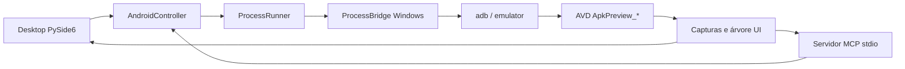

# APK Preview Desktop

Aplicativo Windows para instalar, executar, navegar e inspecionar APKs em um
Android Emulator dedicado. A mesma sessão pode ser controlada pela interface
PySide6 ou por ferramentas MCP locais usadas pelo Codex.

> O projeto não implementa uma máquina virtual Android. Ele controla o Android
> Emulator oficial e renderiza capturas ADB dentro de uma interface desktop.

## Recursos

- descoberta automática do Android SDK no Windows;
- inicialização de AVDs dedicados com prefixo `ApkPreview_`;
- instalação e atualização de APKs com `adb install -r`;
- abertura de aplicativos instalados;
- preview atualizado dentro da janela desktop;
- cliques no preview convertidos em coordenadas Android;
- botões Voltar, Início e Recentes;
- perfis de celular e tablet;
- orientação retrato e paisagem;
- tema claro, escuro ou definido pelo sistema;
- captura PNG e inspeção da árvore UI;
- servidor MCP local sem comandos shell arbitrários;
- launcher Windows sem console e ponte nativa para isolamento de DLLs Qt/ADB.

## Arquitetura



`AndroidController` concentra validação, instalação, navegação e captura.
`ProcessRunner` executa somente binários conhecidos usando listas de argumentos
e `shell=False`. No Windows, `ProcessBridge.exe` cria uma fronteira limpa entre
as DLLs carregadas pelo Qt e as ferramentas do Android SDK.

## Requisitos

- Windows 11;
- Python 3.12 ou superior;
- [uv](https://docs.astral.sh/uv/);
- JDK 21 para projetos Android que precisem ser compilados;
- Android SDK Platform Tools e Android Emulator;
- imagem Android x86_64 compatível;
- virtualização de hardware habilitada.

O SDK é procurado nesta ordem: `ANDROID_HOME`, `ANDROID_SDK_ROOT`, depois
`%LOCALAPPDATA%\Android\Sdk`.

## Instalação para desenvolvimento

```powershell
git clone https://github.com/Famel-svg/apk-preview-desktop.git
cd apk-preview-desktop
uv sync --all-groups
```

Crie pelo Android Studio um AVD cujo nome comece por `ApkPreview_`. Exemplo:
`ApkPreview_Phone_API37`.

## Executar

```powershell
uv run apk-preview-desktop
```

Fluxo básico:

1. selecione o AVD;
2. clique em **Iniciar**;
3. escolha um arquivo `.apk`;
4. clique em **Instalar APK**;
5. selecione o pacote instalado e clique em **Abrir app**;
6. use o preview, perfis de tela e controles Android.

## Servidor MCP

```powershell
uv run apk-preview-mcp
```

| Ferramenta | Função |
| --- | --- |
| `apk_preview_doctor` | Diagnostica SDK, AVDs e dispositivos |
| `list_avds` | Lista AVDs dedicados permitidos |
| `start_session` | Inicializa ou reutiliza um AVD |
| `install_apk` | Instala APK local validado |
| `list_apps` | Lista pacotes de terceiros instalados |
| `launch_app` | Abre um pacote Android |
| `configure_display` | Troca perfil, orientação e tema |
| `inspect_screen` | Captura PNG e árvore UI |
| `interact` | Envia toque ou controle de navegação |
| `stop_session` | Encerra a sessão dedicada |

Plugin portátil: `plugins/apk-preview/`. Configurações com caminhos absolutos da
máquina não fazem parte do repositório.

## Gerar executável Windows

```powershell
.\scripts\build-windows.ps1
```

Saída: `dist/APK Preview Desktop/APK Preview Desktop.exe`.

O launcher usa `.venv` do projeto. Execute `uv sync` antes de abrir o executável.
Artefatos binários não são versionados.

## Testes e qualidade

```powershell
uv run pytest -q
uv run ruff check .
uv run pyright
```

## Estrutura

```text
src/apk_preview/             aplicação, Android e MCP
tests/                       testes automatizados
native/                      launcher e ponte de processos em C#
scripts/                     build Windows
plugins/apk-preview/         plugin MCP portátil
APK_PREVIEW_DESKTOP_SPEC.md  especificação funcional
```

## Segurança

- dispositivos físicos são recusados;
- somente seriais `emulator-*` confirmados como QEMU são aceitos;
- somente AVDs `ApkPreview_*` são controlados;
- APK precisa existir localmente e possuir extensão `.apk`;
- subprocessos não recebem texto shell arbitrário;
- capturas temporárias usam nomes únicos e são removidas;
- `stop_session` não apaga AVD nem dados;
- credenciais, APKs, executáveis, artefatos e configurações locais são ignorados.

Use apenas APKs próprios ou autorizados. Use dados sintéticos e contas de teste.

## Solução de problemas

### Android SDK não encontrado

Defina `ANDROID_HOME` e confirme `platform-tools/adb.exe` e
`emulator/emulator.exe`.

### AVD não aparece

Crie ou renomeie um AVD usando prefixo `ApkPreview_`.

### Erro de DLL do Qt ou console piscando

Recompile com `scripts/build-windows.ps1`. Launcher e ponte são aplicativos
Windows sem console.

### Preview não atualiza

Confirme boot concluído e estado `device` em `adb devices -l`; clique em
**Atualizar**.

## Limitações

- suporte principal: Windows;
- requer Android Emulator oficial;
- não substitui testes instrumentados do APK;
- não contorna autenticação, permissões Android ou proteções do aplicativo;
- executável local depende do ambiente Python sincronizado.

## Licença

Nenhuma licença pública definida. Todos os direitos permanecem com o autor.
